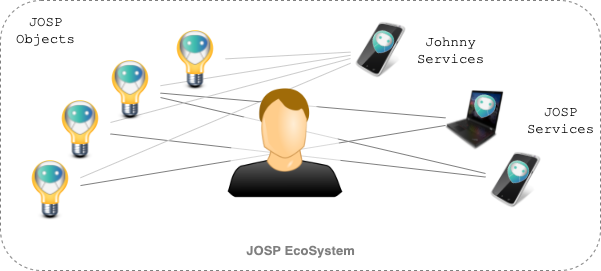

# What is a Personal IoT EcoSystem

An [IoT Ecosystem](/repo_josp.com_docs/features/ecosystem.md) is a tool that helps users manage
their [IoT Solutions](/repo_josp.com_docs/features/iot_solutions.md), made up of connected
[objects](/repo_josp.com_docs/features/objects_integration.md) and [software](/repo_josp.com_docs/features/service_integration.md)
that interact with them. In a [JOSP EcoSystem](/repo_josp.com_docs/features/ecosystem.md),
objects are represented by [JOSP Objects](/repo_josp.com_docs/comps/jod_distributions.md),
while software are called [JOSP Services](/repo_josp.com_docs/comps/jsl_services.md).

Special JOSP services are the [Johnny Services](/repo_josp.com_docs/comps/jsl_services.md#johnny-services),
a set of software provided by the JOSP project for multiple platforms (mobile,
desktop, web, voice). Their purpose is the **management of the JOSP EcoSystem**
by the user. With those services, users can list JOSP Objects and manage their
permission, and enable 3rd part JOSP Service access them.

JOSP Objects can represent different types of objects, such as physical objects
(lamps, doors, washing machines, sensors, industrial machinery ...) but also
objects connected with other technologies, protocols or standards.
See [What objects can be represented?](../2_new_objects/1_what_object_represent.md)
for more details on object's nature.

Once you connected your object to your JOSP EcoSystem, you can start using them
via 3rd part JOSP Services. Look for **which JOSP Service satisfy your needs** and allow it to access to your JOSP objects.
A service can access to multiple objects, as multiple services can access to the same object.

Once you have [registered all your JOSP Objects](../2_new_objects/4_register_object.md)
and updated their permissions to allow [JOSP Service to interact with them](../5_manage_services/2_set_permissions.md),
**you got a full working IoT Solution solving your needs**.

---

1. ### Open a JOSP Service

You can choose your favourite Johnny Service. 
All Johny Services supports user's account creation, object's registration and
permission management.

2. ### Create a JOSP User account

Each Johnny Service, in the main menu, display the 'User's account' sub-menu
(normally a circle with user's avatar). Opening this sub-menu, you can find the
'Register' button. Click on it. 
Now you must fill the form and complete the [user's registration process](../6_user_account/1_register_new_account.md).
Please use a valid email address, because this process will email you to validate it.

If you already have a JOSP account, you can skip this step and [login to the service](../6_user_account/3_login_and_out.md)
using your JOSP credentials.

3. ### Register a JOSP Object

Depending on object's nature there are different methods to start up and register
a JOSP Object. Please review the [What objects can be represented?](../2_new_objects/1_what_object_represent.md)
page for more details on object's nature, and the [power JOSP Object](../2_new_objects/2_poweron_object.md)
or [run JOD Distribution](../2_new_objects/3_run_distribution.md) pages to start
up a JOSP Object. 
When the JOSP Object is up and running, you can proceed with the [object's registration](../2_new_objects/4_register_object.md).

4. ### Allow a JOSP Service access to object

After registering your JOSP Objects you can set their permission and allow [JOSP Service to interact with them](../5_manage_services/2_set_permissions.md). 
For each JOSP Object, you must add a permission to allow desired JOSP Service to
access to that object. [JOSP Permissions](/repo_josp.com_docs/features/permissions.md) have
been designed to guarantee a high degree of customization. Check out next chapters
for detailed examples of JOSP Permissions usage in different context [domestic](2_domestic.md),
[professional](3_professional.md) and [enterprise](4_enterprise.md).

Sometimes, you'll need the JOSP Service's id to set a permission.
It can be found in the JOSP Service's manual.

5. ### Open the JOSP Service and use the object

JOSP Services are normal software, and like any other software they have their
own interfaces and configurations. 
Follow the instructions reported on the JOSP Service's manual to configure it to
[enable the JOSP support](../4_new_services/1_enable_josp_support.md) and [login with your JOSP credentials](../6_user_account/3_login_and_out.md).
Once you are logged in, the JOSP Service can list your JOSP Objects.
Each JOSP Service can only list objects for which it has access permissions. 
Depending on JOSP Service implementation, it can look for all available JOSP Objects
and select autonomously which object use for his purposes. Other times, services
must be configured and user must tell them when use a JOSP Object and when use
another one. JOSP Service's documentation should include a description about how
it uses JOSP Objects, which object's types, and how you can configure it. 
Finally you can start [using the JOSP Services features that interact with your JOSP Objects](../5_manage_services/1_use_objects.md).
JOSP Service to JOSP Objects interactions depends on service nature. For example
some services just collects data from objects and display reports to the user.
Other services also show realtime data to monitoring objects, or provide user
interfaces to remote control objects.

---

Check out more IoT Solution examples based on IoT EcoSystem usage:
* ⏩ [Domestic EcoSystem](2_domestic.md)
* ⏩ [Professional EcoSystem](3_professional.md)
* ⏩ [Enterprise EcoSystem](4_enterprise.md)
